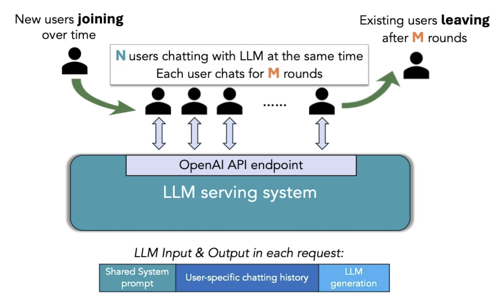

# LLM Benchmark Suite

This repository contains a comprehensive suite of benchmarks for evaluating LLM serving systems. The suite includes multiple scenarios to test different aspects of model performance.

The workload simulated in these benchmarks is a multi-round QA (question answering) task with multiple users interacting with an LLM engine concurrently. An illustration is shown below:



## Available Benchmarks

1. **ShareGPT Benchmark**
   - Replays real-world conversations from [ShareGPT](https://huggingface.co/datasets/anon8231489123/ShareGPT_Vicuna_unfiltered)
   - Default QPS: 1.34

2. **Short Input, Short Output (Synthetic)**
   - System prompt: 0 tokens
   - Chat history: 256 tokens
   - Answer length: 20 tokens
   - Default QPS: 15

3. **Long Input, Short Output (Synthetic)**
   - System prompt: 1000 tokens
   - Chat history: 20000 tokens
   - Answer length: 100 tokens
   - Default QPS: 0.1

## Running Benchmarks

The unified script `run_benchmarks.sh` can run any combination of benchmarks with consistent configuration:

```bash
# Run all benchmarks with default QPS
./run_benchmarks.sh <model> <base_url> <save_file_key> all

# Run specific benchmarks with default QPS
./run_benchmarks.sh <model> <base_url> <save_file_key> sharegpt short-input

# Run specific benchmarks with custom QPS
./run_benchmarks.sh <model> <base_url> <save_file_key> sharegpt short-input 1.34 2.0 3.0
```

### Examples

```bash
# Run all benchmarks with default QPS
./run_benchmarks.sh meta-llama/Llama-3.1-8B-Instruct http://localhost:8000 /mnt/requests/benchmark all

# Run ShareGPT and short input benchmarks with custom QPS
./run_benchmarks.sh meta-llama/Llama-3.1-8B-Instruct http://localhost:8000 /mnt/requests/benchmark sharegpt short-input 1.34 2.0 3.0
```

## Output Files

Results are saved in CSV format with the following naming convention:
- ShareGPT: `<save_file_key>_sharegpt_output_<qps>.csv`
- Short Input: `<save_file_key>_short_input_output_<qps>.csv`
- Long Input: `<save_file_key>_long_input_output_<qps>.csv`

## Processing Results

### Time To First Token (TTFT)
```bash
python3 synthetic-multi-round-qa/multi-round-qa.py --process-summary <your_csv_file>
```

### Inter-Token Latency (ITL)
```bash
python3 synthetic-multi-round-qa/calculat_itl.py
```

## Notes

- The warm-up phase is automatically handled for all benchmarks
- All scripts handle their paths correctly regardless of where they're run from
- QPS values can be customized through command-line arguments
- Results are saved in CSV format with the QPS value in the filename

# Benchmark Docker and Kubernetes Setup

This directory contains the necessary files to run the benchmark in Docker and Kubernetes environments.

## Files

- `Dockerfile`: Defines the Docker image for running the benchmark
- `benchmark-job.yaml`: Kubernetes job configuration
- `run_benchmarks.sh`: Main benchmark script

## Environment Variables

The following environment variables can be configured:

- `MODEL`: The model name to benchmark (default: "meta-llama/Llama-3.1-8B-Instruct")
- `BASE_URL`: The base URL of the vLLM server (default: "http://localhost:8000")
- `SAVE_FILE_KEY`: Prefix for the output files (default: "benchmark_results")
- `SCENARIOS`: Benchmark scenarios to run (default: "all")
  - Options: "all", "sharegpt", "short-input", "long-input"
- `QPS_VALUES`: Space-separated list of QPS values to test (default: "1.34")

## Pulling a pre-built Docker Image

```bash
docker pull lmcache/lmcache-benchmark
```

## Building your own Docker Image

```bash
docker build -t your-registry/benchmark:latest .
```

## Running in Docker

```bash
docker run -e MODEL="meta-llama/Llama-3.1-8B-Instruct" \
           -e BASE_URL="http://vllm-service:8000" \
           -e SAVE_FILE_KEY="benchmark_results" \
           -e SCENARIOS="all" \
           -e QPS_VALUES="1.34 2.0 3.0" \
           -v /path/to/results:/app/results \
           your-registry/benchmark:latest

# To use the pre-built image, replace <your-registry/benchmark:latest> with <lmcache/lmcache-benchmark>
```

## Running in Kubernetes

1. Create a PersistentVolumeClaim for storing results:
```bash
kubectl apply -f benchmark-results-pvc.yaml
```

2. Deploy the benchmark job:
```bash
kubectl apply -f benchmark-job.yaml
```

3. Monitor the job:
```bash
kubectl get jobs
kubectl logs job/benchmark-job
```

## Output

The benchmark results will be saved in the mounted volume with the following structure:
- `{SAVE_FILE_KEY}_sharegpt_qps{X}.csv` for ShareGPT benchmarks
- `{SAVE_FILE_KEY}_short_input_qps{X}.csv` for short input benchmarks
- `{SAVE_FILE_KEY}_long_input_qps{X}.csv` for long input benchmarks

Where `X` is the QPS value used for that run. 
